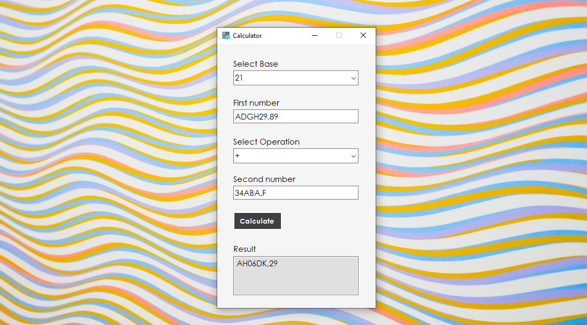

# Base-Calculator
 > A calculator that can work with two numbers in any same base. Made with Windows Forms in C++.

  

This project consists of a single screen made in Windows Forms. All events are treated and user mistakes are being handled. The user inserts two numbers in a single base from 2 to 36, select the base and select the operation. The program will then calculate and show the value on screen.

*Print of the interface. Background photo by Dom J on Pexels.*

## Installation

Download the project and run the .exe file. Or, open the project in your prefered .NET Framework IDE and run it there. 

## Usage example

This project uses really interesting algorithms that are similar processes to those on paper used to solve math problems. And, you can use them as inspiration or as part of similar solutions.

## Notes

- The division hasn't yet been implemented, but probably will be soon. Feel free to leave suggestions and open a pull request.
- The project has been tested for a wide variety of numbers.

## Meta

Copyright (c) Eduardo Migueis and Rodrigo Smith 2020.

Distributed under the MIT license. See ``LICENSE`` for more information.

[https://github.com/edumigueis/Base-Calculator](https://github.com/edumigueis)
